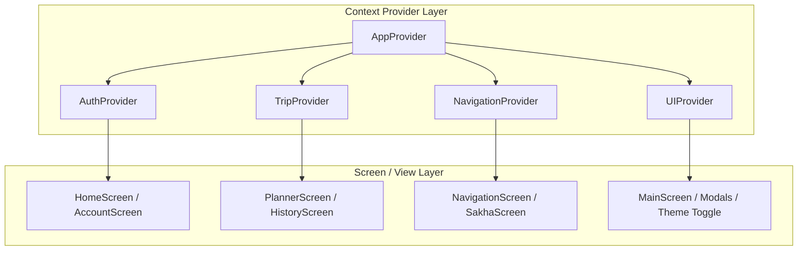
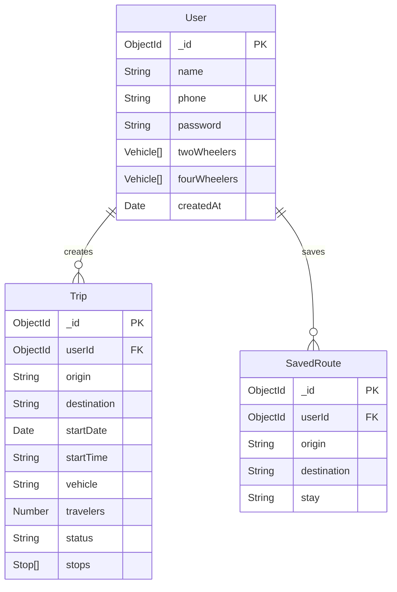
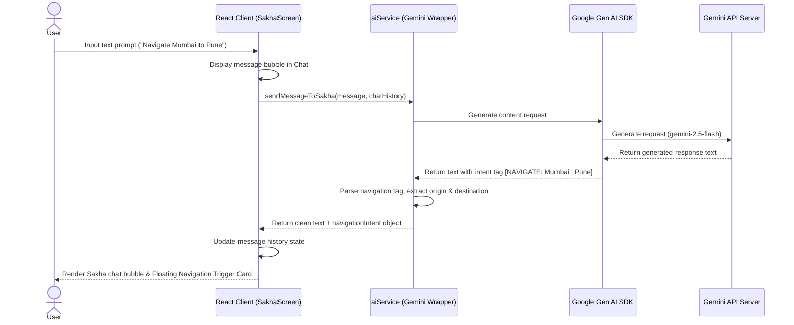
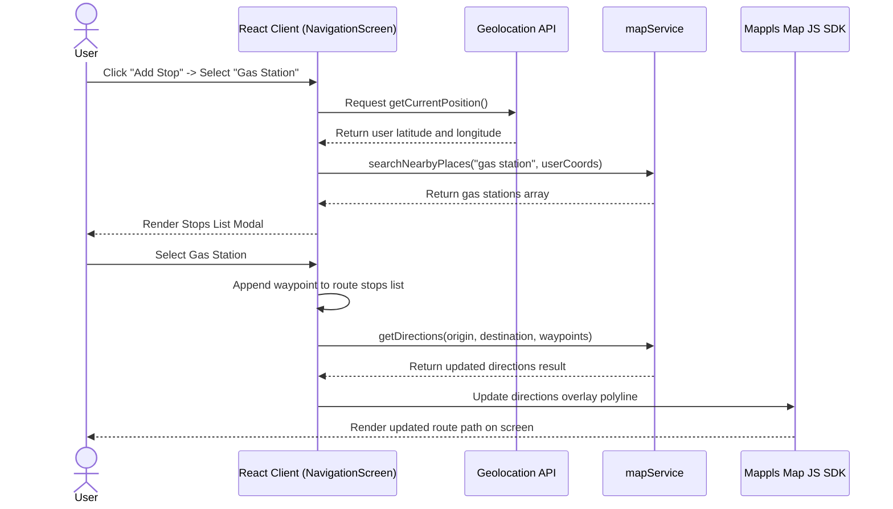

# TripSync System Architecture Guide

This document describes the high-level and low-level system design, frontend state layout, backend controllers, database schema, API reference endpoints, and sequence diagrams of TripSync.

---

## 1. High-Level Design (HLD)

TripSync operates on a decoupled client-server architecture.

```
┌────────────────────────────────────────────────────────┐
│                      CLIENT TIER                       │
│  - React 19 SPA (Vite compiled static assets)          │
│  - Tailwind CSS v4 local PostCSS compilation           │
│  - Mappls Web Map JS SDK Loader                        │
│  - Google Gen AI client chat SDK                       │
└───────────────────────────┬────────────────────────────┘
                            │ HTTPS / JSON Envelopes
                            ▼
┌────────────────────────────────────────────────────────┐
│                    APPLICATION TIER                    │
│  - Node/Express REST API Server                        │
│  - Security: Helmet, Rate limiters, CORS filters       │
│  - Validation: express-validator input verification    │
└───────────────────────────┬────────────────────────────┘
                            │ Mongoose ODM
                            ▼
┌────────────────────────────────────────────────────────┐
│                     DATABASE TIER                      │
│  - MongoDB Instance (user accounts, saved routes,      │
│    and trip history logs)                              │
└────────────────────────────────────────────────────────┘
```

---

## 2. Frontend State & Navigation Architecture

To prevent cascading parent re-renders, the React global state is split into domain-specific contexts. Backwards compatibility is preserved using an aggregator pattern in `AppContext.tsx`.



### Context Breakdown
* **`AuthProvider`:** Session states (`user`, `isLoading`), register/login API calls, profile onboarding flow, and user vehicle fleet settings.
* **`TripProvider`:** Synchronizes saved routes and completed trip histories with API databases.
* **`NavigationProvider`:** Manages turn-by-turn states, waypoint stops, starting/ending coordinate selections.
* **`UIProvider`:** Controls global theme settings, tab selections, and modal states.
* **Geocoding & Routing Engine:** Acts as an adapter communicating directly with Mappls REST API endpoints (Suggest, Geocode, Advanced Route, Nearby search).

---

## 3. Database Schema & Models

TripSync utilizes Mongoose schemas mapping structure to MongoDB documents.



* **Indexing:** 
  * `User.phone` (Unique index): Speeds up login checks.
  * `Trip.userId` (Index): Speeds up fetching trip history.
  * `SavedRoute.userId` (Index): Speeds up retrieving saved places.
* **Mongoose Hooks:** `User` schema encrypts passwords using a pre-save hook using `bcryptjs` with 10 salt rounds.

---

## 4. API Reference Endpoints

API routes are prefixed with `/api`. All JSON responses follow consistent payload envelopes.

### Authentication Endpoints

* **POST `/api/auth/signup`:** Registers new user.
  * *Request Body:* `{ name, phone, password, twoWheelers: [], fourWheelers: [] }`
  * *Response (201 Created):* `{ _id, name, phone, twoWheelers, fourWheelers, token }`
* **POST `/api/auth/login`:** Validates user credentials.
  * *Request Body:* `{ phone, password }`
  * *Response (200 OK):* `{ _id, name, phone, token }`

### Trip Logs Endpoints (Protected - JWT Required)

* **POST `/api/trips`:** Saves a trip log.
  * *Request Body:* `{ origin, destination, startDate, startTime, vehicle, travelers, stops: [] }`
  * *Response (210 Created):* Saved Trip Document object.
* **GET `/api/trips`:** Retrieves current user's history logs.
* **DELETE `/api/trips/:id`:** Removes a specific trip log.

### Saved Routes Endpoints (Protected - JWT Required)

* **POST `/api/saved-routes`:** Saves a planned route.
  * *Request Body:* `{ origin, destination, stay }`
* **GET `/api/saved-routes`:** Retrieves saved routes.
* **DELETE `/api/saved-routes/:id`:** Removes a saved route.

---

## 5. Sequence Diagrams

### Sakha AI Co-pilot Chat Flow



### Live Map Waypoint Addition Flow


